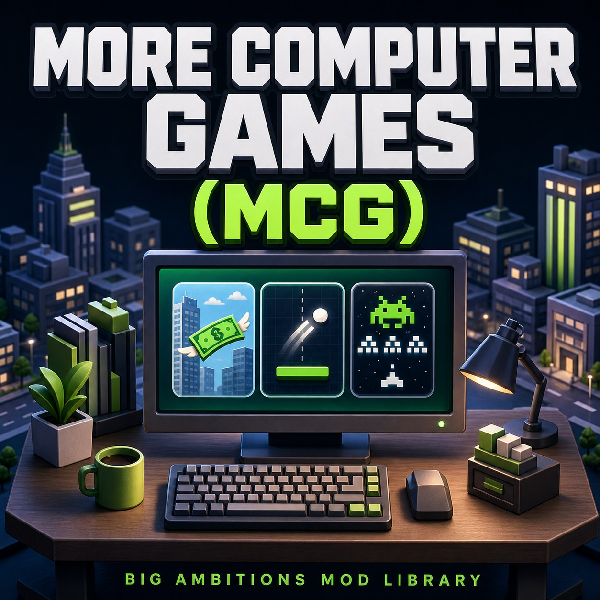

# LIB BA More Computer Games — 1.0.0

A shared library for adding mini-games to the computers inside Big Ambitions.



**[Get MCG on Steam Workshop](https://steamcommunity.com/sharedfiles/filedetails/?id=3793604724)**

**This repository contains MCG only.** FlappyAmbition is a separate mod: its sources, assets, tests and binaries are not included. The original brick-breaker game remains available without installing any additional games.

**Version 1.0.0** brings a game menu onto the computer monitor, with **22 interface languages**, resources loaded only after selection and local high scores for vanilla and mod games. The native panel offers a translated **Return to menu [Backspace]** button and keeps its original **Leave** button with a **[TAB]** hint. No other mod library is required. Read the release notes in [English](releases/1.0.0/RELEASE_NOTES.en.md) or [French](releases/1.0.0/RELEASE_NOTES.fr.md), or browse the [changelog](CHANGELOG.md).

## Documentation

The detailed guides below are currently in French:

- [Install and use MCG](docs/UTILISATION.md).
- [Create a compatible game](docs/CREER_UN_JEU.md), then read the [full API reference](API.md).
- [Build and verify MCG](docs/COMPILATION.md).
- [Source and package privacy](docs/CONFIDENTIALITE.md).
- [Steam Workshop publication checklist and ready-to-copy texts](releases/1.0.0/PUBLISHING_CHECKLIST.md).

The Steam display title is **LIB BA More Computer Games (MCG)**, also stored in **release-assets/WORKSHOP_TITLE.txt** for publication. The short name is **More Computer Games (MCG)**. For manual installation, use **ModsLocal/LIB_BA_MoreComputerGames**; do not keep an active local duplicate alongside the Workshop version. The technical mod ID and assembly name remain **LIB_BaComputerGames** to preserve references from game mods and the C# API. Big Ambitions uses the folder name in its local mod list; the Workshop title is entered separately when publishing.

The Steam thumbnail is **Thumbnail.jpg**. The original PNG and generation prompt are in **release-assets/**. This promotional artwork illustrates the library's purpose; it is not a screenshot or a list of included games.

## What MCG provides

When MCG is active, the computer's native **Play Video Games** action takes the player to the computer and opens the game menu on its monitor. The original brick-breaker remains available without additional game mods. The time-passing action is unchanged, and disabling MCG restores the original play action.

| Action | Keyboard | Native panel |
| --- | --- | --- |
| Select a game | Up / Down | — |
| Launch the selection | Enter | — |
| Return to the MCG menu or cancel loading | Backspace | Return to menu [Backspace] |
| Leave the computer | Tab | Original translated Leave caption + [TAB] |
| Open the native pause menu | Escape | Unchanged |

MCG shortcuts do not act while the pause menu or options are open; Tab also respects native UI focus. The catalog stays on the monitor, with no separate popup or additional computer interaction to learn.

Game authors provide a description, gameplay and an optional resource loader. MCG handles the catalog, monitor integration, standard controls and session cleanup.

During a game or loading, **Return to menu [Backspace]** also appears beside **Leave** in the native panel below the monitor. It returns to the MCG catalog or cancels loading without leaving the computer. The label follows the game's language; the button is hidden in the catalog and respects pause/options and UI input blocking. It uses the native button style and requires no additional UI library.

The native Leave button keeps its translated caption and shows **[TAB]** while using the MCG computer menu or a game. Its action is unchanged; the hint is removed when leaving the computer.

MCG also saves local high scores for the original brick-breaker and added games through the same round-completion event. Only a strictly higher score replaces a record. Records are separated by Steam profile, game and rules, shared across saves and stored outside ModsLocal. No additional online account or sharing is required. Abandoned rounds do not count.

Record files use managed JSON serialization and are read back before an atomic write. If an earlier MCG build produced a file containing only the schema and profile header, recording resumes without inventing missing scores; the next new record preserves that original file as a backup. Other unreadable, unsupported or cross-profile files remain protected.

See [API.md](API.md) for the interfaces, a minimal example and AssetBundle loading.

## Languages

MCG's interface is translated into all **22 selectable game languages**: Czech, Danish, Dutch, English, Finnish, French, German, Greek, Hungarian, Italian, Japanese, Korean, Lithuanian, Polish, Brazilian Portuguese, Romanian, Russian, Spanish (Spain), Turkish, Ukrainian, Simplified Chinese and Traditional Chinese. It follows the language selected in Big Ambitions; game mods provide their own gameplay translations. The existing English/French strings are preserved.

Native locale codes: `cs da de el en es fi fr hu it ja ko lt nl pl pt ro ru tr uk zh-cn zh-tw`. In particular, the game's Brazilian Portuguese code is `pt`. The build checks these files against the installed game's selectable-language index.

## Available games

- **Brick Breaker** — the original Big Ambitions game, available without installing another game mod.
- **[FlappyAmbitions](https://github.com/capisoft-lib/BigAmbitions_MCG_FlappyAmbitions)** — fly a banknote between office towers. A separate MCG game mod and an example for developers creating their own games.
- **[Snacke](https://github.com/capisoft-lib/BigAmbitions_MCG_Snacke)** — grow a bread snake into a sandwich by eating lettuce, tomatoes and rare cheese. A separate MCG game mod translated into all 22 game languages.
- **[Ambitions Invaders](https://github.com/capisoft-lib/BigAmbitions_MCG_AmbitionsInvaders)** — pilot a banknote and fire yellow lasers at pixel-art rival tycoons in a horizontal shooter. A separate MCG game mod translated into all 22 game languages.
- **[Tetrix](https://github.com/capisoft-lib/BigAmbitions_MCG_Tetrix)** — stack building-shaped pieces and clear floors in a separate falling-block game.

Additional games must be installed separately. MCG does not include or automatically download them; FlappyAmbitions is not required to install, build or use this library.

## Roadmap

- **Leaderboard** — We plan to explore adding a shared leaderboard soon, so players can compare high scores. This feature is not available yet, and there is no confirmed release date. For now, high scores remain local.

## Loading lifecycle

- On city load: register game metadata and read the small local-record file; no gameplay objects or bundles are preloaded.
- At the computer: instantiate the lightweight menu; show installed games and local best scores.
- After selection on the monitor: show loading, then load that game's optional resources and create its gameplay/camera. The native activity and monitor remain open.
- On return to the menu, session closure, game removal or library unload: stop gameplay and release resources. Cancelled loads release their resources when they complete.
- DLLs stay loaded in the process, as with other Unity mods. This mechanism does not unload assemblies.

Games can register before or after the library becomes active. A namespaced identifier such as **mystudio:my-game** must be unique in the catalog; duplicates are explicitly rejected. Each registration owns a token that removes only its own game and sessions.

## Dependencies and distribution

Target: **Big Ambitions 1.0 Build 3670 / Unity 2022.3.62f2**. **MCG requires no other mod library.** The monitor menu uses the game's native computer integration and Unity UI. Individual game mods must reference MCG as a separate dependency, never bundle its DLL, and declare MCG in Steam Required Items when publishing.

MCG 1.0.0 preserves the public API signatures used by the 0.2.0 game mods. **Game authors must still rebuild against the MCG 1.0.0 DLL (assembly version 1.0.0.0)**: the native loader can reject a game binary that still references major version 0. The library's namespace, assembly name, technical mod ID and record-file schema are unchanged. Mod loading remains under the official SDK: MCG does not scan the disk for DLLs, download code or use a network service.

The [1.0.0 release folder](releases/1.0.0/) contains English/French release notes, full Steam descriptions in BBCode, short descriptions and change notes, plus an [upload checklist](releases/1.0.0/PUBLISHING_CHECKLIST.md). Update the [existing Workshop item](https://steamcommunity.com/sharedfiles/filedetails/?id=3793604724) through Big Ambitions' **Mods > Mod Creator > Edit mod**, using the built `LIB_BA_MoreComputerGames` folder. Never upload the source checkout or its private build directory. MCG requires **no Steam Required Items**. Compatible games list MCG as their dependency. Pushing GitHub does not update the Workshop item's content or description.

## Build and verification

From the repository root, with the .NET 8 SDK installed:

```powershell
dotnet run --project tools/Tests~/MCG.Tests.csproj -c Release
```

The [build guide](docs/COMPILATION.md) explains how to build MCG alone using only your own Big Ambitions and Unity installations. Proprietary dependencies and generated binaries are not tracked in Git. GitHub's "Code" ZIP contains sources, not a ready-to-play mod package.

The included tests do not launch Big Ambitions or touch its saves. Earlier Unity checks using external game fixtures are documented separately in [VERIFICATION.md](VERIFICATION.md); those fixtures are not included in this repository. Native computer UI and in-game compatibility checks are still pending, as described there. The build script does not install or publish anything.

Original sources are released under the MIT license. Big Ambitions, Unity and other dependencies retain their respective licenses.

## ☕ Support MCG

If you enjoy MCG, you can help support its development with a coffee. Someone still has to keep the developer working.

**[Buy me a coffee](https://buymeacoffee.com/capitaine)**
